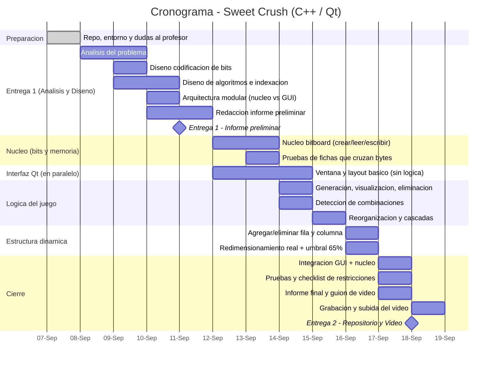
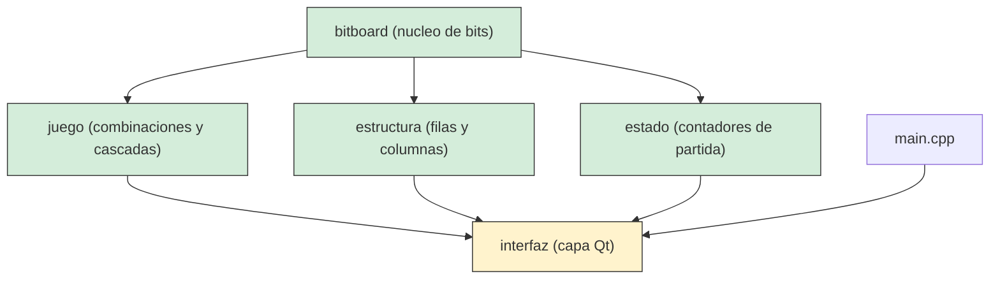

# Plan de Desarrollo — Desafío I: Sweet Crush (C++ / Qt)

**Curso:** Informática II, semestre 2026-2
**Basado en:** Desafío I — Implementación Sweet Crush mediante manipulación de bits en C++
**Elaborado:** 8 de septiembre de 2026
**Propósito:** plan de gestión de proyecto para organizar el desarrollo.

**Autores:** Emiliano de Jesus Lince Diaz - Esteban Garces Atehortua

---

## Contenido del documento
0. Ficha del proyecto
1. Alcance del proyecto
2. Restricciones obligatorias del proyecto
3. Cronograma general
4. Estructura de Desglose del Trabajo (EDT)
5. Plan detallado por fase y día
6. Arquitectura técnica propuesta
7. Priorización si el tiempo se agota
8. Gestión de riesgos
9. Estrategia de control de versiones
10. Checklist de entregables por fecha

---

## 0. Ficha del proyecto

| Dato | Valor |
|---|---|
| Lenguaje | C++ (no ANSI C) |
| Framework obligatorio | Qt |
| Entrega 1 | Viernes 11 de septiembre de 2026, 11:59 p.m. — Informe preliminar (contextualización, análisis, diseño) |
| Entrega 2 | Viernes 18 de septiembre de 2026, 11:59 p.m. — Evidencia de implementación (Codigo fuente + video) |
| Días disponibles hasta Entrega 1 | 3 días (hoy incluido) |
| Días disponibles entre Entrega 1 y Entrega 2 | 7 días |
| Entregables en Ude@ | 2 enlaces únicamente: repositorio público + video de YouTube |
| Evaluación adicional | Sustentación oral obligatoria planeada con el profesor|

>  **Nota de plazos:** el margen de tiempo es muy ajustado. Este plan asume dedicación diaria desde hoy, incluyendo el fin de semana del 12–13 de septiembre. La sección 7 propone una ruta de "mínimo viable" por si el tiempo se agota.

---

## 1. Alcance del proyecto

El proyecto consiste en construir, en C++ sobre Qt, una versión del juego *Sweet Crush* donde:

- El tablero es rectangular, de dimensiones definidas al iniciar la ejecución.
- Cada posición del tablero se representa con **exactamente 3 bits**, empaquetados de forma continua (sin relleno ni alineación a byte).
- El programa detecta combinaciones de 3 o más fichas iguales en horizontal o vertical, las elimina, reorganiza el tablero (caída + relleno) y procesa cascadas automáticamente. **IMPORTANTE** (ya no son cascadas y caídas, si no, que se completa con fichas) <--- Preguntar.
- El tablero admite modificaciones estructurales en juego: agregar/eliminar filas o columnas en cualquier posición, con redimensionamiento real de la memoria dinámica reservada.
- Toda la lógica de acceso a fichas se implementa mediante operadores a nivel de bits, sin desempaquetar el tablero a una estructura auxiliar.

El resultado final incluye: código fuente modular, informe de desarrollo redactado personalmente, video demostrativo en YouTube, repositorio público con historial de commits, y sustentación oral.

---

## 2. Restricciones obligatorias del proyecto

Estas restricciones condicionan **todas** las decisiones de diseño e implementación. Incumplir cualquiera de ellas implica nota cero, según el documento del desafío.

### Prohibido usar
- `struct`, `class`, `template` ni ningún objeto definido por el estudiante
- La STL (`vector`, `list`, `map`, `algorithm`, etc.) ni ninguna estructura dinámica suministrada por bibliotecas externas
- Objetos tipo `string` (`std::string`)
- Sintaxis de ANSI C (por ejemplo, Nosotros debemos preferir `new`/`delete` sobre `malloc`/`free`)
- Un byte, entero u otro tipo nativo completo para representar una sola ficha
- Sobredimensionamiento de memoria: reservar de más "por si acaso", mantener las dimensiones máximas de forma permanente, o reservar desde el inicio para expansiones futuras
- Delegar el "core" de la solución (tablero, bits, lógica de juego) a código de autoría externa
- Herramientas de IA para redactar el informe final o para generar el video
- Modificaciones al repositorio después de la fecha límite

### Obligatorio incluir
- C++ implementado sobre el framework Qt
- Diseño modular multi-archivo (`.h` / `.cpp`)
- Uso efectivo de punteros, arreglos y memoria dinámica real
- Cada ficha representada en exactamente 3 bits, empaquetada sin relleno (una ficha puede cruzar la frontera entre dos bytes)
- Operadores bitwise (`&`, `|`, `^`, `~`, `<<`, `>>`) como mecanismo central de acceso/modificación
- Bits inválidos o vacíos agrupados a la **izquierda** de la trama; bits válidos desde el bit menos significativo (LSB)
- Redimensionamiento real de memoria al cambiar filas/columnas; al eliminar, solo reducir físicamente cuando el uso caiga por debajo del **65%** del tamaño actual
- Repositorio público con commits regulares distribuidos en el tiempo
- Informe redactado personalmente (no generado por IA)
- Video de 5 a 11 minutos, sin IA, con participación explícita de todo el equipo (si aplica) <---- Preguntar "Si tenemos que grabarnos a nosotros".
- Asistencia obligatoria a la sustentación oral (cámara si es virtual)

---

## 3. Cronograma general



### Hitos principales

| Hito | Fecha | Qué implica |
|---|---|---|
|  Entrega 1 | 11 sept, 11:59 p.m. | Repo con informe preliminar (contextualización + análisis + diseño) accesible |
|  Entrega 2 | 18 sept, 11:59 p.m. | Repo completo + informe final + video subidos en Ude@ |
|  Sustentación | Por concertar | Defensa oral obligatoria; sin cambios al repo desde el 18 sept |

---

## 4. Estructura de Desglose del Trabajo (EDT)

1. **Fase 0** — Preparación
2. **Fase 1** — Análisis y diseño *(Entrega 1)*
3. **Fase 2** — Núcleo de manipulación de bits
4. **Fase 3** — Lógica de juego básica
5. **Fase 4** — Reorganización y cascadas
6. **Fase 5** — Modificación estructural dinámica
7. **Fase 6** — Pruebas integrales y verificación de restricciones
8. **Fase 7** — Informe final, video y entrega *(Entrega 2)*

---


## 5. Plan detallado por fase y día

### Fase 0 — Preparación
**Fecha: 8 de septiembre**

| Tarea | Por qué importa |
|---|---|
| Crear repositorio público (GitHub/GitLab) | Debe contener informe + código + anexos, y ser visible desde ya |
| Definir estructura de carpetas `/src`, `/include`, `/docs` | Exige diseño modular multi-archivo |

### Fase 1 — Análisis y diseño (Entrega 1)
**Fechas: 8 al 11 de septiembre — vence el 11 a las 11:59 p.m.**

| Fecha | Tareas |
|---|---|
| 8 sept | Analizar el documento completo del desafío; listar requerimientos funcionales, de evaluación y restricciones |
| 9 sept | Definir la codificación de 3 bits: asignar código a las 6 fichas y decidir el uso de los 2 códigos libres |
| 9-10 sept | Diseñar las fórmulas de indexación (posición lógica → bit global → byte + desplazamiento) y el algoritmo genérico de lectura/escritura de 3 bits que pueden cruzar dos bytes |
| 10 sept | Diseñar la arquitectura modular: qué función va en cada `.h`/`.cpp`, y cómo se separa el núcleo de la interfaz Qt |
| 10 sept | Diseñar los algoritmos de detección de combinaciones, cascadas y redimensionamiento (incluida la regla del umbral del 65%) |
| 11 sept | Redactar el informe preliminar (contextualización, análisis, diseño), de forma personal y sin IA |
| 11 sept, antes de 11:59 p.m. | Commit final y verificación de que el repositorio es accesible |
| Asignar responsables por módulo | Facilita paralelizar |

### Fase 2 — Núcleo de manipulación de bits
**Fechas: 12 de septiembre**

| Fecha | Tareas |
|---|---|
| 12 sept | Codificar un prototipo mínimo de `obtener_ficha` / `establecer_ficha` para validar el diseño del informe |
| 12 sept | Implementar la creación/liberación del tablero en memoria dinámica y el cálculo de bytes mínimos necesarios |
| 12 sept | Implementar `obtener_ficha` y `establecer_ficha` con operadores bitwise, manejando el caso de fichas repartidas entre dos bytes |
| 12 sept | Probar exhaustivamente el acceso a fichas en distintas posiciones (bordes de fila, bordes de byte, tableros de distinto tamaño) |

**Fecha: 13 de septiembre, Descansar.**

### Fase 3 — Lógica de juego básica
**Fecha: 14 de septiembre**

| Tareas |
|---|
| Generación aleatoria inicial de fichas, con distribución uniforme entre los 6 tipos |
| Visualización del tablero en formato binario y en formato de fichas |
| Eliminación de la ficha indicada por el usuario |
| Detección de combinaciones horizontales y verticales (3 o más fichas iguales consecutivas) |
| Resolución de combinaciones simultáneas (una ficha participando en ambas direcciones a la vez) |

### Fase 4 — Reorganización y cascadas
**Fecha: 15 de septiembre**

| Tareas |
|---|
| Reorganización vertical: las fichas restantes caen para ocupar los espacios vacíos |
| Relleno de nuevas fichas aleatorias hasta recuperar las dimensiones del tablero |
| Bucle de detección y resolución de cascadas hasta que el tablero se estabilice |
| Registro del número de cascadas y actualización del estado del juego (puntuación, contadores) |

### Fase 5 — Modificación estructural dinámica
**Fecha: 16 de septiembre**

| Tareas |
|---|
| Agregar una fila o columna en cualquier posición (no solo en los extremos) |
| Eliminar una fila o columna en cualquier posición |
| Redimensionamiento real de la memoria: reservar nuevo bloque, trasladar los bits relevantes, liberar el bloque anterior |
| Implementar y probar la regla del umbral del 65% para decidir cuándo reducir la memoria físicamente |


### Fase 6 — Pruebas integrales y verificación de restricciones
**Fecha: 17 de septiembre**

| Tareas |
|---|
| Ejecutar los casos de prueba clave: cascada de al menos 3 niveles, eliminación de fila y columna intermedias, combinación simultánea horizontal + vertical |
| Revisar que ningún archivo use `string`, `struct`, `class`, `template` ni cabeceras de la STL |
| Corregir bugs detectados |

### Fase 7 — Informe final, video y entrega (Entrega 2)
**Fechas: 17-18 de septiembre — vence el 18 a las 11:59 p.m.**

| Fecha | Tareas |
|---|---|
| 17 sept | Completar el informe final: algoritmos implementados, problemas de desarrollo enfrentados, evolución de la solución |
| 17 sept | Preparar y cronometrar el guion del video (presentación ≤3 min, demo ≤3 min, explicación de código ≤5 min; total entre 5 y 11 min) |
| 18 sept | Grabar el video con la participación explícita de todo el equipo (si aplica), sin herramientas de IA |
| 18 sept | Subir el video a YouTube y verificar que el enlace sea público |
| 18 sept, antes de 11:59 p.m. | Commit final, verificar accesibilidad del repositorio, y subir los dos enlaces en Ude@ |

---

## 6. Arquitectura técnica propuesta

Se recomienda separar completamente el **núcleo** (tablero, bits, lógica de juego) de la **interfaz** (Qt), por dos razones: primero, porque así el núcleo puede probarse de forma aislada; segundo, porque facilita demostrar que "el core" no delega en código externo ni depende de clases, tal como exige el desafío.

```
📁 SweetCrush/
├── 📁 include/
│   ├── bitboard.h      → Firmas de acceso a fichas por bits
│   ├── juego.h         → Firmas de combinaciones y cascadas
│   ├── estructura.h    → Firmas de agregar/eliminar fila y columna
│   ├── estado.h        → Firmas de contadores de partida
│   └── interfaz.h      → Ventana y widgets (única cabecera que incluye Qt)
├── 📁 src/
│   ├── bitboard.cpp
│   ├── juego.cpp
│   ├── estructura.cpp
│   ├── estado.cpp
│   ├── interfaz.cpp
│   └── main.cpp        
├── 📁 docs/
│   ├── informe.pdf
│   └── Plan_Desarrollo_Reto_1.md  
└── README.md
```



*(Verde = módulos sin dependencia de Qt; amarillo = única capa que usa clases de Qt. Confirme con el profesor si esta separación satisface la restricción de "sin `class`")*

---

## 7. Priorización si el tiempo se agota

Dado lo ajustado del cronograma, conviene tener claro qué NO se puede sacrificar bajo ninguna circunstancia y qué sí se puede simplificar si el tiempo aprieta:

**No negociable (nota cero si falta):**
1. Núcleo de acceso a fichas por bits, funcionando correctamente
2. Memoria dinámica real (reservada y liberada correctamente, sin sobredimensionar)
3. Ausencia total de `struct`/`class`/`template`/STL/`string` en el proyecto
4. Diseño modular multi-archivo

**Alto valor (parte fuerte de la evaluación: 35% + 35%):**
5. Generación aleatoria, visualización y eliminación de fichas
6. Detección de combinaciones horizontal/vertical y su resolución simultánea
7. Reorganización y cascadas, con su registro

**Requerido, pero simplificable si el tiempo aprieta:**
8. Agregar/eliminar fila y columna en posición arbitraria — si falta tiempo, priorice que funcione en los extremos antes que en posiciones intermedias, y documente la limitación con honestidad en el informe
9. El umbral del 65% — si falta tiempo, priorice que el crecimiento de memoria sea siempre correcto; el decrecimiento con umbral es secundario frente a eso
10. La interfaz Qt — una interfaz simple (grid de etiquetas o botones, sin gráficos elaborados) es preferible a invertir tiempo en estética en detrimento de la lógica

> Esta priorización sigue el peso de la evaluación (bits 30%, memoria 35%, lógica 35%) y las condiciones que impiden agendar sustentación.

---

## 8. Gestión de riesgos

| Riesgo | Impacto | Mitigación |
|---|---|---|
| Interpretar mal una restricción (p. ej. uso de `QString`) | Nota cero | Resolver las preguntas críticas con el profesor en los primeros 1-2 días |
| Tiempo insuficiente dado el plazo de 10 días | Alto | Seguir la priorización de la sección 7|
| Bug al leer/escribir una ficha que cruza dos bytes | Alto | Diseñar casos de prueba específicos desde el primer día de implementación |
| Error en la lógica del umbral del 65% | Medio | Documentar la fórmula exacta antes de codificar; probar casos límite (justo en 65%, justo debajo, justo arriba) |
| Commits concentrados solo al final | Alto (evidencia de evolución insuficiente) | Programar commits diarios desde el 8 de septiembre, incluso de avances pequeños |
| Informe o video con apoyo de IA en el contenido final | Nota cero | Usar IA solo para planear (como este documento); redactar/grabar el contenido final personalmente |
| Video fuera del rango de 5-11 min o sin cubrir los casos exigidos | Se descalifica la sustentación | Preparar y cronometrar el guion antes de grabar |
| Repositorio o video inaccesibles al momento de la revisión | No se agenda sustentación | Verificar la visibilidad pública de ambos enlaces antes de cada entrega |

---

## 9. Estrategia de control de versiones

- Commits desde el primer día (8 de septiembre), no solo al final de cada fase
- Mensajes descriptivos, por ejemplo: `[nucleo] implementa obtener_ficha con manejo de cruce de bytes`, `[juego] agrega deteccion de combinaciones verticales`
- Una sola rama (`main`) es suficiente para el tamaño de este proyecto; si el equipo es grande, considere ramas por módulo y fusiónelas con frecuencia para evitar conflictos de último minuto
- Recuerde: **cero cambios permitidos después del 18 de septiembre, 11:59 p.m.**

---

## 10. Checklist de entregables por fecha

| Fecha límite | Debe estar en el repositorio | Debe subirse a Ude@ |
|---|---|---|
| 11 sept, 11:59 p.m. | Informe preliminar (contextualización, análisis, diseño) | Enlace al repositorio |
| 18 sept, 11:59 p.m. | Código fuente completo y modular, informe final, historial de commits distribuido en el tiempo | Enlace al repositorio + enlace al video de YouTube |

---
